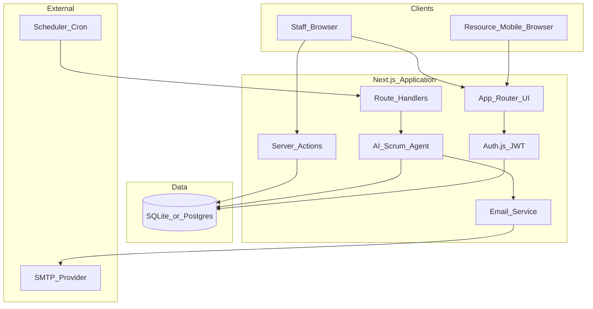
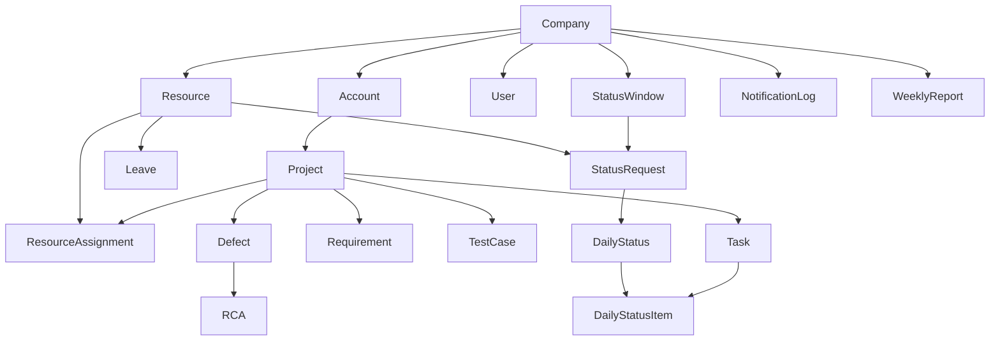
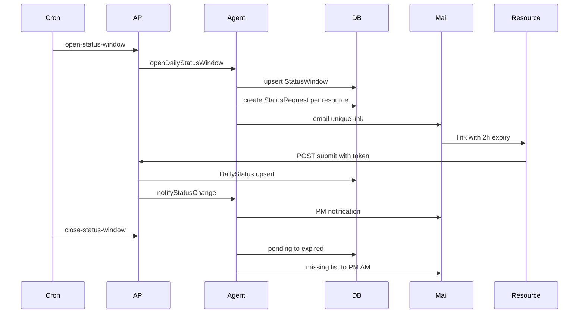
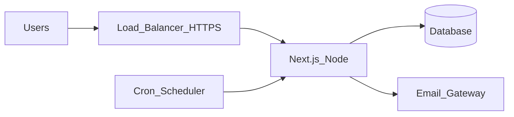

# AI Scrum Master — Architecture Document

**Product:** AI Scrum Master  
**Version:** 0.1.0 (MVP)  
**Date:** 2026-07-17

---

## 1. Executive summary

AI Scrum Master is a standalone web application that replaces manual Scrum Master status collection with a scheduled agent. It owns its data store (no Jira/ADO required for MVP), collects resource-wise daily status through **time-bound secure links**, manages multi-account SDLC artifacts, and surfaces role-based dashboards plus email notifications and weekly packs for Project Managers and higher management.

---

## 2. Goals and constraints

### Goals

- Multi-client (**Account**) and multi-**Project** delivery visibility  
- Automated daily status chase with **2-hour** link expiry from window start  
- Dual deadline tracking (client-committed vs resource-committed)  
- SDLC coverage: requirements, tests, defects, RCA, leaves  
- Event and weekly email communications to stakeholders  
- Company → account → project → resource management matrix  

### Constraints (MVP)

- Single deployable Next.js app (monolith)  
- SQLite for local/demo; PostgreSQL recommended for production (schema is Prisma-portable)  
- Email-only notifications (no Slack/SMS)  
- No Excel intake; no ALM tool sync  

---

## 3. High-level architecture



### Style

- **Modular monolith:** UI, APIs, agent jobs, and persistence in one deployable.  
- **Server-rendered App Router** for staff dashboards; client component for status form.  
- **Agent** is application logic invoked by UI buttons or secured cron HTTP API (not a separate microservice in MVP).

---

## 4. Technology stack

| Layer | Technology |
|-------|------------|
| Runtime | Node.js 22+ |
| Framework | Next.js 16 (App Router), React 19, TypeScript |
| Styling | Tailwind CSS 4 |
| Auth | Auth.js (NextAuth v5) — credentials + JWT session |
| ORM | Prisma 7 |
| DB (dev/MVP) | SQLite via `@prisma/adapter-better-sqlite3` |
| Email | Nodemailer (SMTP) or console fallback |
| Validation | Zod |
| Jobs | HTTP cron endpoint (`/api/cron`) |

---

## 5. Logical domain model



### Multi-tenancy

- Tenant key: `companyId` on users, resources, windows, notifications, reports.  
- Accounts/projects scoped through `Account.companyId`.  
- Staff sessions carry `companyId` + `role` in JWT.  
- Status links are **not** full sessions: opaque token bound to one `StatusRequest`.

---

## 6. Component design

### 6.1 Presentation

| Area | Path | Responsibility |
|------|------|----------------|
| Login | `/login` | Credentials sign-in |
| Dashboard shell | `/dashboard/*` | Nav + role-aware staff UI |
| Overview matrix | `/dashboard` | Company RAG / KPIs |
| Hierarchy CRUD | accounts, projects, resources | Master data |
| Project workspace | `/dashboard/projects/[id]` | Tasks, requirements, tests, defects, RCA |
| Status compliance | `/dashboard/status` | Window and submission visibility |
| Leaves / reports / settings / agent | matching routes | Ops and analytics |
| Public status form | `/status/[token]` | Resource submit/update within TTL |

### 6.2 Application services

| Module | File | Responsibility |
|--------|------|----------------|
| Prisma client | `src/lib/prisma.ts` | DB access |
| Auth | `src/lib/auth.ts`, `auth.config.ts` | Login + edge-safe middleware config |
| Tokens | `src/lib/tokens.ts` | Status token generate/hash |
| Email | `src/lib/email.ts` | Send + `NotificationLog` dedupe |
| Agent | `src/lib/agent.ts` | Window open/close, deadlines, weekly packs, status-change notify |
| Server actions | `src/app/actions.ts` | Mutations for CRUD + manual agent triggers |

### 6.3 APIs

| Endpoint | Auth | Purpose |
|----------|------|---------|
| `/api/auth/[...nextauth]` | public | Auth.js handlers |
| `/api/status/submit` | status token in body | Create/update `DailyStatus` |
| `/api/cron` | `Authorization: Bearer CRON_SECRET` | Scheduled agent jobs |

---

## 7. Key runtime flows

### 7.1 Daily status window



### 7.2 Status link security

1. Generate random `token` (base64url).  
2. Store `SHA-256(token)` as `tokenHash`; never store raw token.  
3. Bind to `statusWindowId` + `resourceId`.  
4. Accept submit only if `now <= expiresAt` and state ≠ expired/leave.  
5. Allow edit until expiry; then lock.

### 7.3 Notification dedupe

- `NotificationLog` unique on `(companyId, dedupeKey)`.  
- Deadline keys: e.g. `deadline:approaching:{taskId}:client:3d`.  
- Status change notifications use skip-dedupe / unique timestamps for submit vs update events; blocker alerts dedupe per status id.

---

## 8. Data store

### Persistence choices

| Environment | Recommended store |
|-------------|-------------------|
| Local / demo | SQLite file (`DATABASE_URL=file:./dev.db`) |
| Production | PostgreSQL (switch Prisma `provider` + adapter) |

### Important entities (summary)

- **StatusWindow** — one per company per calendar date  
- **StatusRequest** — per resource per window; state machine: `pending` → `submitted` | `expired` | `skipped_leave`  
- **DailyStatus** / **DailyStatusItem** — hours, narrative, blockers, task progress lines  
- **Task** — `clientDeadline`, `resourceDeadline`, `progressPct`  
- **WeeklyReport** — scope `resource` | `project` | `account` | `company` + metrics JSON + narrative  

Migrations live under `prisma/migrations`.

---

## 9. Security architecture

| Concern | Approach |
|---------|----------|
| Staff auth | bcrypt password hashes; JWT session via Auth.js |
| Route protection | Middleware/`authorized` callback for `/dashboard` |
| Cron | Shared secret bearer token |
| Status links | Hashed tokens, TTL, single-purpose route |
| Tenant isolation | Queries scoped by `session.user.companyId` |
| Secrets | `.env` / platform secret store; never commit real secrets |

**Edge note:** Middleware uses `auth.config.ts` only (no Prisma) so Edge runtime does not load SQLite native bindings.

---

## 10. Observability (MVP)

- Application logs (Next.js server)  
- Console email dump when SMTP unset (includes extracted `Links:`)  
- `NotificationLog` table as audit of outbound messages  
- `WeeklyReport` table as historical pack store  

Future: structured logging, metrics (submission rate, job latency), APM.

---

## 11. Scalability and extension points

| Extension | How |
|-----------|-----|
| PostgreSQL | Change Prisma datasource + connection adapter |
| Real AI narratives | Plug `OPENAI_API_KEY` into weekly narrative generator (template today) |
| Queue workers | Move agent jobs from HTTP cron to BullMQ / Cloud Tasks |
| Multi-company SaaS | Already `companyId`-scoped; add signup/billing later |
| Jira sync | New connector service writing into Task/Defect tables |

---

## 12. Deployment topology (logical)



See [DEPLOYMENT.md](./DEPLOYMENT.md) for concrete steps and NFRs.

---

## 13. Directory map (implementation)

```
ai-scrum-master/
  prisma/           schema, migrations, seed
  src/app/          routes, UI, server actions, APIs
  src/lib/          auth, prisma, agent, email, tokens
  docs/             FRD, architecture, deployment, usage
```

---

## 14. Design decisions (ADR-style)

| Decision | Choice | Rationale |
|----------|--------|-----------|
| Status intake | Magic link form only | Matches process; avoids brittle Excel parsing |
| Expiry | Fixed window (start + 2h) | Fair cutoff for all resources same day |
| Monolith | Next.js full-stack | Fast MVP; single deploy unit |
| Agent trigger | Cron HTTP | Simple to schedule on any host |
| Defect density | defects / closed requirements | No KLOC required |
